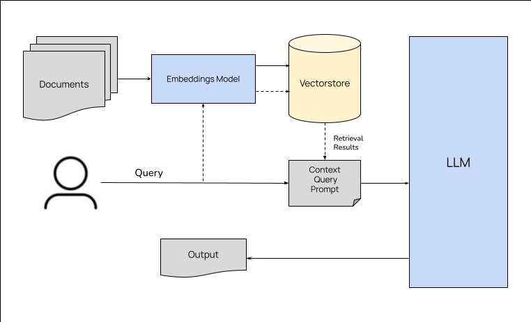

# Hackathon NLP: Analyse des Rapports SFCR avec RAG

## **Description du Projet**
Cette application **Streamlit** exploite une architecture innovante de **RAG (Retrieval-Augmented Generation)** pour analyser efficacement les rapports **SFCR (Solvency and Financial Condition Reports)**. L'objectif est de fournir une solution intuitive pour extraire, analyser, et répondre à des questions en langage naturel basées sur des documents financiers complexes.

### **Points Forts**
- Extraction automatisée de texte depuis des fichiers PDF.
- Traitement optimisé grâce à une segmentation intelligente des textes.
- Indexation rapide via des embeddings sémantiques et une base vectorielle performante.
- Réponses précises et contextualisées générées à l'aide de modèles GPT.

---

## **Fonctionnalités Principales**
1. **Téléchargement de fichiers PDF** :
   - Interface intuitive permettant de télécharger plusieurs documents simultanément.
2. **Extraction de texte** :
   - Conversion précise des documents PDF en texte brut grâce à `PyPDF2`.
3. **Segmentation intelligente des textes** :
   - Découpage des textes en **chunks** (segments) de 1000 caractères avec chevauchement de 200 caractères pour conserver le contexte.
4. **Création d'embeddings sémantiques** :
   - Utilisation des **OpenAI Embeddings** pour représenter chaque chunk sous forme de vecteurs.
5. **Recherche vectorielle** :
   - Identification des chunks pertinents via l'algorithme de similarité de **FAISS**.
6. **Réponses générées par GPT** :
   - Les réponses aux questions sont générées à partir des chunks identifiés et d'un prompt personnalisé.

---

## **Architecture Naïve RAG (Retrieval-Augmented Generation)**
La solution repose sur une approche hybride combinant la recherche d'information (retrieval) et la génération de texte (generation). Voici les étapes détaillées :

### **Étape 1 : Extraction des chunks pertinents**
- Les documents sont convertis en embeddings vectoriels, stockés dans **FAISS**.
- À chaque requête, les chunks les plus similaires sont identifiés.

### **Étape 2 : Augmentation par le contexte**
- Les chunks sélectionnés sont fournis au modèle GPT comme contexte.

### **Étape 3 : Génération des réponses**
- Les réponses sont produites à partir du modèle GPT en utilisant un prompt spécialement conçu.

## **Détails Techniques**

### **1. Modèle de Langage (LLM)**
- **Choix : ChatGPT** 
  - Reconnu pour sa capacité à traiter des documents financiers complexes avec une précision exceptionnelle.
  - Sa maîtrise du français en fait un outil adapté pour ce cas d'usage.

### **2. Approche de Chunking Optimisée**
- Le découpage des textes est réalisé via **RecursiveCharacterTextSplitter**, garantissant :
  - Une conservation optimale du contexte.
  - Une continuité dans la recherche de similarités.
  - Une analyse approfondie des sections pertinentes.

### **3. Embeddings Sémantiques**
- Générés par **OpenAI Embeddings**, les vecteurs sémantiques :
  - Capturent les nuances contextuelles et les relations conceptuelles.
  - Identifient efficacement les correspondances complexes dans le contenu.

### **4. Recherche Vectorielle avec FAISS**
- **FAISS (Facebook AI Similarity Search)** optimise la recherche grâce à :
  - Une indexation rapide et efficace, même pour des bases volumineuses.
  - Des temps de requête ultra-rapides (millisecondes).
  - Une utilisation optimisée des ressources système.

---

## **Pipeline de Traitement**
### **Étapes Clés**
1. **Prétraitement** :
   - Extraction de texte, découpage en chunks, et vectorisation.
2. **Recherche Sémantique** :
   - Identification des chunks les plus pertinents à l'aide de FAISS.
3. **Génération Contextuelle** :
   - Création de réponses précises guidées par un prompt personnalisé.

## **Démo Vidéo**
[Démo Vidéo](./DEMO.mp4)

## Prérequis 
### **1. Prérequis**
- Python 3.8 ou version supérieure.
- Clé API OpenAI.
- Bibliothèques nécessaires (voir `requirements.txt`).

## **Prochaines Améliorations**
- Support multi-langue.
- Visualisation interactive des embeddings.
- Optimisation pour de grands ensembles de données.

