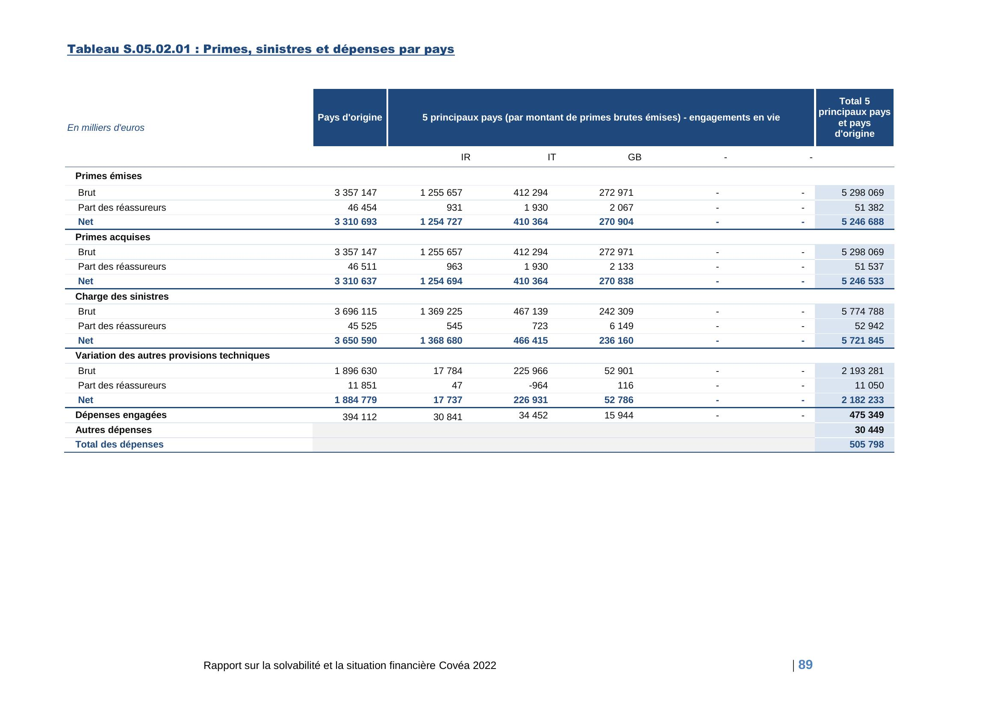
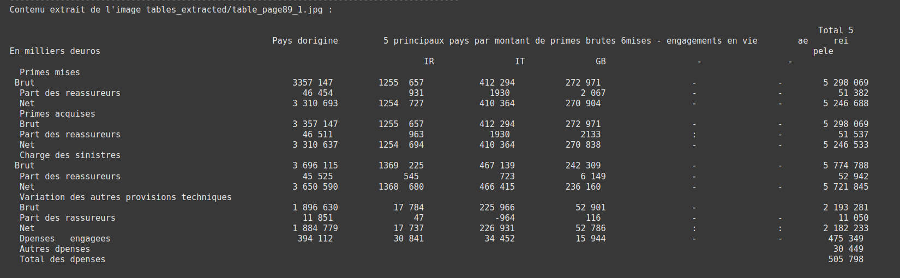
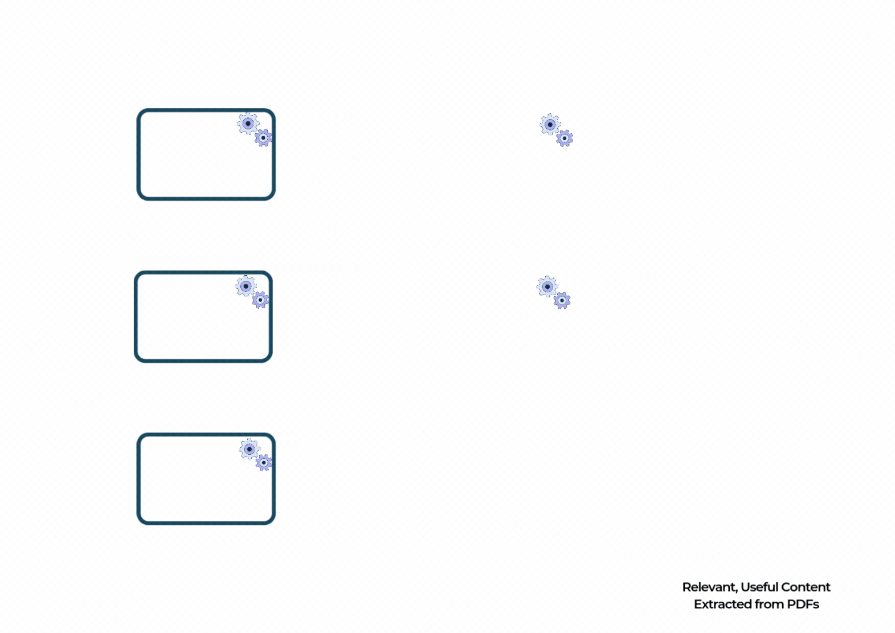
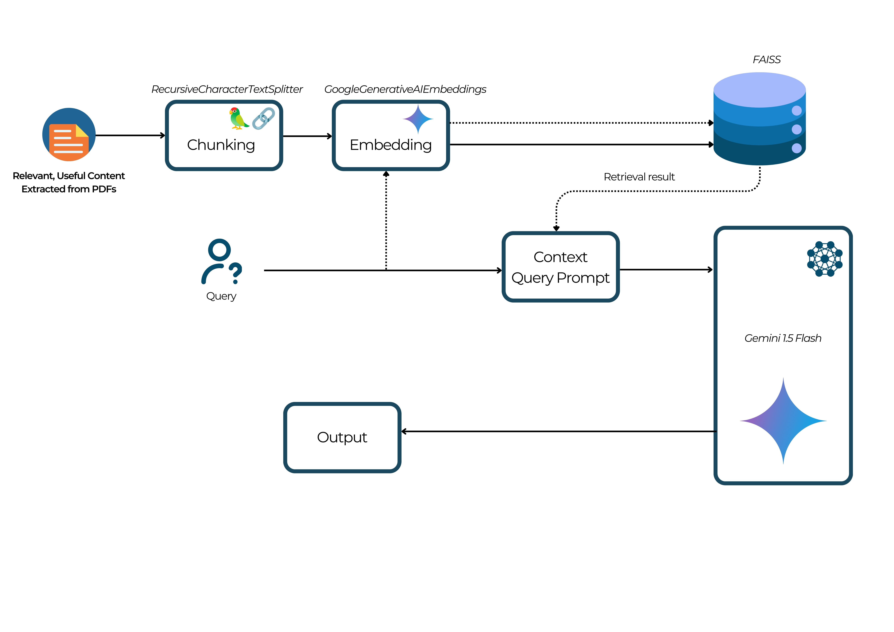

# README: Hackathon SmartDoc.ai

## L'Equipe 2
- BADOLO Christian Thomas
- KINDO Harouna 
- NABI Daniel

Ce projet a été réalisé dans le cadre du hackathon SmartDoc.ai, ayant pour objectif principal le traitement de documents financiers au format PDF pour en extraire uniquement les contenus pertinents à l'aide d'outils NLP. Voici une description des étapes réalisées lors des différentes parties cet exercice.

---
# Premiere partie (using Google Vision API)

## 1. Traitement des Données OCR

### Fonctionnalités Utilisées :
La fonction **`produce_brut()`** fournie dans le fichier `helper.py` (que l'on a gardé comme telle) a été utilisée telle quelle pour transformer les fichiers JSON obtenus à partir de l'OCR (Google Vision API) en un tableau Excel structurant les blocs textuels extraits des rapports SFCR. Cette fonction constitue la base des analyses effectuées dans les étapes suivantes.


## 2. Détection et Labélisation des Contenus

### Objectifs :
L'objectif principal était de classifier automatiquement les blocs textuels extraits des rapports SFCR en trois catégories :
- **Inutile** : Contenus non pertinents comme les bas de page, hauts de page et tableaux.
- **Paragraphe** : Contenus informatifs pertinents pour le corps principal des rapports.
- **Titre** : Grands titres ou sous-titres délimitant les différentes sections des rapports.

### Approche Technique :
Pour cette étape, une fonction nommée **`label_content(df, thresholds=None)`** a été développée dans le fichier [notebook](google_vision_api/report_cleaning.ipynb). Elle repose sur des seuils définis pour différencier les catégories de contenu.

#### Fonctionnement de `label_content()` :
1. **Seuils Utilisés :**
   - Position verticale (`pos_y`) pour les en-têtes et pieds de page.
   - Nombre de caractères (`chars`) pour distinguer titres et paragraphes.
   - Taille des caractères et hauteur des blocs (`char_size`, `height`) pour identifier le contenu des tableaux.

2. **Classification :** Chaque bloc textuel est évalué selon ces seuils pour être classifié en "Inutile", "Titre" ou "Paragraphe". Par exemple :
   - Si la position verticale est proche des bords (haut ou bas de page), il est marqué comme "Inutile".
   - Si le nombre de caractères est très faible, il est marqué comme "Titre".
   - Si le nombre de caractères est élevé, il est considéré comme "Paragraphe".

### Filtrage et Génération des Fichiers Texte :
Une fois la labélisation effectuée, les données inutiles sont filtrées pour ne conserver que les titres et paragraphes pertinents. Le contenu résultant est ensuite sauvegardé dans un fichier texte suivant une organisation claire :
- Les titres et paragraphes sont regroupés par page.
- Une ligne de séparation est ajoutée entre les pages pour une meilleure lisibilité.

#### Exemple de Code :
Le fichier généré est produit à l'aide de la fonction suivante :
```python
# Fonction pour générer un fichier texte organisé
 def generate_text(dataframe, filename):
     with open(filename, 'w', encoding='utf-8') as f:
         current_page = None
         for _, row in dataframe.iterrows():
             if current_page is None or row['num_page'] != current_page:
                 if current_page is not None:
                     f.write("\n" + "="*50 + "\n")  # Séparateur pour une nouvelle page
                 current_page = row['num_page']
                 f.write(f"\nPage {current_page}\n")

             if row['Label'] == 'Titre':
                 f.write(f"\n{row['text']}\n")
             elif row['Label'] == 'Paragraphe':
                 f.write(f"{row['text']}\n")

             f.write("\n")
```

### Résultats :
- **Classification Automatisée :** Les blocs textuels sont correctement identifiés et classés.
- **Fichiers Lisibles :** Les fichiers texte produits sont clairs et organisés par page avec une distinction nette entre les titres et les paragraphes.

### ⚠️ L'on a [ici](google_vision_api/text) 4 fichers `.txt` de l'extraction des 4 [rappors PDF](data/pdfs) 


### Analyse :

La labélisation a été faite selon des critères qu'il est difficile de généraliser.
L'étape de labélisation, bien que fonctionnelle, présente certaines limites dues à la difficulté de définir des critères universels applicables à tous les types de rapports SFCR. En effet, les seuils définis pour la position verticale, la taille des caractères et le nombre de caractères sont basés sur des observations spécifiques, ce qui peut entraîner des erreurs ou des ambiguïtés dans certaines situations.


## Conclusion :
Ces étapes ont permis d'établir une base solide pour l'analyse des rapports SFCR en filtrant efficacement le contenu utile. Les techniques de traitement et de labélisation développées ici préparent à la deuxième partie de l'exercice, centrée sur l'implémentation d'une architecture RAG.


## 3. Bonnus : Extraction lisible des informations des tableaux


### Objectif  
L'objectif de cette partie était de détecter et extraire automatiquement les tableaux présents dans des fichiers PDF, puis de convertir leur contenu en texte structuré tout en préservant la disposition tabulaire. Le code a été devollopé dans ce [notebook](tables/table_detection_and_extraction.ipynb)


### Étapes de la Méthodologie

1. **Détection des Tableaux**  
   - **Modèle Utilisé :** Un modèle [YOLO🌐](https://huggingface.co/foduucom/table-detection-and-extraction) a été employé pour détecter les tableaux dans les pages du PDF.  
   - **Processus :** Les pages des PDF sont converties en images. Le modèle analyse ces images pour repérer les zones contenant des tableaux et les découpe en sous-images correspondant à chaque tableau.  
   - **Paramètres Clés :** Des seuils de confiance (confidence score) et IoU (Intersection over Union) ont été ajustés pour optimiser la précision de la détection des tableaux.

2. **Extraction des Images des Tableaux**  
   - Une fois détectés, les tableaux sont extraits sous forme d'images individuelles et sauvegardés dans un répertoire. Chaque image représente un tableau unique trouvé dans le document.

3. **Conversion des Images en Texte**  
   - **Outil Utilisé :** [Tesseract-OCR🌐](https://github.com/tesseract-ocr/tesseract) a été utilisé pour convertir le contenu des images en texte lisible et structuré.  
   - **Prétraitement :** Les images des tableaux ont été redimensionnées et converties en RGB pour améliorer la qualité de l'extraction du texte.  
   - **Structure Conservée :** Une analyse des positions et des blocs textuels a permis de recréer la structure tabulaire originale dans le format texte.

4. **Résultats Structurés**  
   - Le contenu textuel des tableaux est formaté dans des formats exploitables (dans notre cas du texte) pour faciliter les analyses ultérieures par les modèles.


### Résultats  
Cette méthodologie a permis :  
- Une détection précise des tableaux dans des documents PDF complexes.  
- Une extraction fidèle du contenu tabulaire, avec une préservation de la structure.  
- Une préparation des données sous une forme facilement exploitable pour des besoins d'analyse ou d'intégration.

#### Exemple SFCR [COVEA](data/pdfs/sfcr_covea_2022.PDF) : image détectée puis text détecté

- Apres détection des tables par YOLO (page 89)


- Apres détection du text dans l'image


### Analyse :
Le modèle YOLO permet une detection et extraction systématique sous forme d'image de toutes les tables dans les différents PDF. La difficulté apparente se trouve au niveau de l'extraction des tables de ces images (dans le cas de l'utilisation de modèle lite non multimodale)
La prochaine étape cruciale consiste à intégrer les tableaux extraits dans le texte labélisé, afin de reconstituer une structure documentaire cohérente proche de l'original. L'objectif est de fusionner intelligemment les résultats de la labélisation (titres et paragraphes) avec les tableaux transformés en texte. Cette intégration nécessiterait de développer un algorithme capable d'identifier la position contextuelle de chaque tableau dans le document original, en se basant sur les titres adjacents, la pagination, et le contenu environnant. Il s'agirait de créer un mécanisme qui repositionne chaque tableau à son emplacement initial, en respectant la hiérarchie des sections et la logique narrative du document. Cette approche permettrait de générer un document reconstitué où les tableaux seraient réinsérés de manière organique, préservant ainsi la structure et la cohérence du rapport SFCR initial.

Cette étape de fusion pourrait être réalisée ultérieurement.

---

# Premiere partie (using  Llama Parser)

## 1. Exctraction avec  LlamaParse
Vu les limites apparentes de la méthode d'extraction avec `Google Vision`, nous avons effectué un benchmark qui a abouti à la solution de `LlamaCloud` : [Llama Parser](https://docs.llamaindex.ai/en/stable/llama_cloud/llama_parse/). LlamaParse est un parseur de documents sur le marché spécialement conçu pour les améliorer les RAG. Cette solution a permis d'extraire de manière fidèle les informations de divers PDF sous forme de `Markdown`. En utilisant `LlamaParse`, nous avons pu surmonter les défis liés à l'extraction de contenu complexe, tels que les tableaux, les diagrammes et l'ordre de lecture, en obtenant des résultats plus précis et mieux structurés que ceux offerts par les modèles multimodaux traditionnels. Grâce à son approche hybride, LlamaParse a réduit les erreurs d'extraction, tout en offrant une meilleure gestion du contenu visuel et textuel.

### ⚠️ [Code LlamaParse](llama_parser/Hackathon_LlamaParse.ipynb)

## 2. Résulats
### ⚠️ L'on a [ici](llama_parser/markdown) 4 fichers `.md` de l'extraction des 4 [rappors PDF](data/pdfs) 


### Parsing flow



---

# Deuxieme partie

## 🏗️ Architecture Technique Détaillée

### 1. Choix du Modèle de Langage (LLM)(voir [code](rag_architecture/response.py))

La sélection de Google Generative AI (Gemini), et plus particulièrement de la version [1.5 Flash](https://ai.google.dev/gemini-api/docs/models/gemini#gemini-1.5-flash), résulte d'une analyse approfondie des besoins spécifiques de notre cas d'usage. Ce modèle se distingue par sa capacité exceptionnelle à comprendre et à traiter des contextes financiers complexes. Sa maîtrise du français, combinée à des performances de pointe en analyse de documents techniques, en fait un choix stratégique.

Les points forts de Gemini incluent sa capacité à :
- Maintenir la cohérence dans l'interprétation de documents longs et techniques
- Gérer efficacement les nuances du langage financier
- Fournir des réponses structurées et professionnelles
- S'adapter rapidement à différents styles de rapports financiers

### 2. Stratégie Avancée de Chunking(voir [code](rag_architecture/inital_vector.py))

La méthode de découpage des documents (chunking) représente un élément crucial de notre architecture RAG. Utilisant RecursiveCharacterTextSplitter, nous avons développé une approche qui va au-delà du simple découpage mécanique des documents.

Notre stratégie vise à :
- Préserver l'intégrité sémantique des sections
- Maintenir un contexte suffisamment large pour une compréhension profonde
- Permettre une recherche de similarité précise
- Minimiser la fragmentation des informations cruciales

Avec des chunks de 100 000 caractères et un chevauchement de 200 caractères, nous garantissons une transition en douceur entre les segments, assurant qu'aucun détail important ne soit perdu lors de l'analyse.

### 3. Vectorisation Sémantique de Pointe(voir [code](rag_architecture/inital_vector.py))

Le modèle d'embedding de Google (`models/embedding-001`) transforme chaque segment de texte en un vecteur mathématique riche en informations sémantiques. Cette transformation permet une recherche de similarité qui va bien au-delà des correspondances littérales, en capturant les nuances et les relations conceptuelles entre différentes parties du document.

Les avantages de cette approche incluent :
- Une compréhension contextuelle profonde
- La capacité de relier des concepts financiers apparemment disparates
- Une précision accrue dans la recherche de segments pertinents

### 4. Moteur de Recherche Vectoriel FAISS(voir [code](rag_architecture/inital_vector.py))

FAISS (Facebook AI Similarity Search) représente la colonne vertébrale de notre système de recherche. Cette bibliothèque open-source développée par Facebook permet des recherches de similarité ultrarapides, même sur de très grands ensembles de données.

Son implémentation nous permet de :
- Indexer rapidement des milliers de pages de rapports financiers
- Effectuer des recherches de similarité en quelques millisecondes
- Gérer efficacement des volumes importants de données vectorisées

## 🔍 Processus de Recherche et Génération

Notre chaîne de traitement intègre plusieurs étapes sophistiquées pour garantir des réponses de haute qualité :

1. **Prétraitement Intelligent**: Découpage et vectorisation des documents
2. **Recherche Sémantique**: Identification des segments les plus pertinents
3. **Génération Contextualisée**: Production de réponses précises et professionnelles

Le prompt engineering joue un rôle crucial, guidant le modèle avec des instructions détaillées pour :
- Utiliser exclusivement le contexte fourni
- Maintenir une structure de réponse professionnelle
- Gérer explicitement les cas où l'information est incomplète ou absente

### RAG architecture



---

# Interface Streamlit(voir [code](main.py))


## 🎥 Démo de mon projet

Voici une démonstration vidéo :

<iframe src="https://www.loom.com/share/158c4b96c70c447685bd8416f31841e5?sid=b5102413-d26f-4136-b670-e049b11bcdfc">
</iframe>


---

# Étapes pour utiliser ce projet : 

1. **Cloner le dépôt**  
   Téléchargez le projet sur votre machine en clonant le dépôt GitHub avec la commande suivante :  
   ```bash
   git clone https://github.com/zenitsu93/Hackathon_Smartdoc.ai.git
   ```

2. **Se déplacer dans le répertoire du projet**  
   Entrez dans le répertoire du projet cloné :  
   ```bash
   cd Hackathon_Smartdoc.ai
   ```

3. **Créer un environnement virtuel (.venv)**  
   Créez un environnement virtuel Python pour isoler les dépendances du projet :  
   ```bash
   python -m venv .venv
   ```

4. **Activer l’environnement virtuel**  
   - Sur **Windows** :  
     ```bash
     .venv\Scripts\activate
     ```
   - Sur **Mac/Linux** :  
     ```bash
     source .venv/bin/activate
     ```

5. **Installer les dépendances**  
   Installez les bibliothèques nécessaires à partir du fichier `requirements.txt` :  
   ```bash
   pip install -r requirements.txt
   ```

6. **Créer un fichier `.env` pour les variables d’environnement**  
   - Créez un fichier `.env` dans le répertoire principal du projet.  
   - Ajoutez-y votre clé API Google :  
     ```
     GOOGLE_API_KEY=VotreCléAPI
     ```
     Remplacez `VotreCléAPI` par la clé API que vous avez obtenue depuis la console [Google Cloud](https://aistudio.google.com/apikey).

7. **Lancer l'application avec Streamlit**  
   Exécutez la commande suivante pour démarrer l'application :  
   ```bash
   streamlit run main.py
   ```

---
