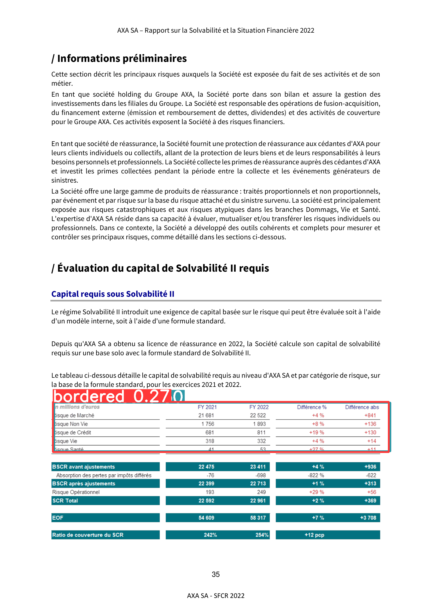
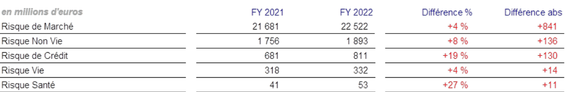

# Hackathon SmartDoc.ai

**Membres du groupe :**
- **HIROUCHE Walid** : [walid.hirouche@centrale-casablanca.ma](mailto:walid.hirouche@centrale-casablanca.ma)
- **BENKIRANE Reda** : [reda.benkirane@centrale-casablanca.ma](mailto:reda.benkirane@centrale-casablanca.ma)
- **LOZI Adam** : [adam.lozi@centrale-casablanca.ma](mailto:adam.lozi@centrale-casablanca.ma)
- **El OTMANI Hamza*** : [hamza.elotmani@centrale-casablanca.ma](mailto:hamza.elotmani@centrale-casablanca.ma)

---

## **Résumé**

Ce projet a été réalisé dans le cadre du **Hackathon SmartDoc.ai**, et son objectif principal est de résoudre les problématiques liées à l’analyse des rapports SFCR grâce à des outils de Machine Learning et une architecture RAG (**Retrieval-Augmented Generation**).

---

## **Problématique**

Lorsqu'un Data Scientist travaille sur des rapports au format PDF, il est souvent confronté à des défis liés à la qualité des résultats des OCR :
1. Les **informations inutiles** (bas/hauts de page, contenus répétitifs) perturbent l’analyse.
2. Les données **non structurées** (ex. tableaux, graphes) nécessitent un travail supplémentaire pour en extraire des informations exploitables.

# Partie 1 : Création des fichiers pour le **RAG**

### Pourquoi ne pas trier par longueur de texte (`len`) ?
Une méthode basique comme un tri par la longueur des textes n'est pas efficace. Par exemple :
- Certains **paragraphes courts** peuvent être plus courts que certains **titres**, créant une zone grise difficile à distinguer.
- Les **bas de page répétitifs**, malgré leur contenu inutile, peuvent avoir une longueur suffisante pour être classés comme des titres.

C’est pourquoi nous avons développé une approche hybride combinant des manipulations manuelles et des modèles de Machine Learning.

---

## **Note importante sur les scripts**

Tous les scripts sont **flexibles** et acceptent un chemin en argument lors de leur exécution. Si aucun chemin n'est spécifié, un **chemin par défaut** sera utilisé. Cela vous évite de modifier constamment les scripts pour changer les dossiers de travail.

**Exemple** :
```bash
python csv_to_txt.py data/csv_model
```
Si le chemin `data/csv_model` n'est pas spécifié, le script utilisera par défaut `data/csv_model`.

---

## **Architecture du projet**

Le projet est structuré comme suit :

```
.
├── classification
│   ├── [requirements.txt](classification/requirements.txt)
│   ├── [training_model.ipynb](classification/training_model.ipynb)
│   └── weights
│       ├── pca.pkl
│       ├── scaler.pkl
│       └── xgboost_classifier.json
├── data
│   ├── csv
│   │   ├── allianz-1-to-94.csv
│   │   ...
│   │   └── covea-output-1-to-98.csv
│   ├── csv_manual
│   │   ├── axa-output-1-to-71.csv
│   │   └── training_data.csv
│   ├── csv_model
│   │   ├── predicted_allianz-1-to-94.csv
│   │   ...
│   │   └── predicted_covea-output-1-to-98.csv
│   ├── json
│   │   ├── allianz-1-to-94.json
│   │   ...
│   │   └── covea-output-1-to-98.json
│   └── txt
│       ├── predicted_allianz-1-to-94.txt
│       ...
│       └── predicted_covea-output-1-to-98.txt
├── [csv_to_txt.py](csv_to_txt.py)
├── [helper_improved.py](helper_improved.py)
├── [predict_labels.py](predict_labels.py)
├── [prepare_training_data.py](prepare_training_data.py)
└── README.md
```

---

## **Étapes détaillées**

### 1. **Conversion des JSON en CSV : [helper_improved.py](helper_improved.py)**

- **But** : Convertir les fichiers JSON produits par l’OCR en CSV structurés pour faciliter le traitement ultérieur.
- **Ajouts importants** :
  - Une colonne `id` pour conserver l’ordre des lignes, utile pour le reclassement après modification de l'ordre des lignes sur Excel.
  - Une colonne `label` vide pour permettre une classification manuelle dans Excel.

#### Commande à exécuter :
```bash
python helper_improved.py [data/json]
```

#### Résultat :
- Les fichiers JSON dans `data/json/` sont convertis en fichiers CSV et enregistrés dans `data/csv/`.

---

### 2. **Classification manuelle dans Excel**

#### Étapes recommandées :
1. **Trier sur la colonne `chars`** :
   - Permet de regrouper les lignes avec peu de caractères, souvent inutiles, et de distinguer les paragraphes et titres.
2. **Trier sur la colonne `text`** :
   - Regroupe les lignes avec un format similaire (ex. `B.1`, `B.2`, `/`), pour classifier les titres par blocs.
3. **Finaliser avec la colonne `label`** :
   - Afin d'identifiez les lignes encore non classées si on a encore de la patience.
4. **Rétablir l’ordre initial** :
   - On utilise la colonne `id` pour cela.

**Attention** : Pas besoin de labéliser toutes les lignes. Le fichier suivant ne prendra que les lignes déjà classées dans les 4 fichiers et les fusionera dans un seul fichier d'entraînement `training_data.csv`.

---

### 3. **Préparation des données d’entraînement : [prepare_training_data.py](prepare_training_data.py)**

- **But** : Générer un fichier `training_data.csv` avec uniquement les lignes labélisées.
- **Actions** :
  - Concatène tous les fichiers de `data/csv_manual/`.
  - Supprime les colonnes inutiles à l'entraiînement : `id`, `text`, `num_page`.

#### Commande à exécuter :
```bash
python prepare_training_data.py [data/csv_manual]
```

#### Résultat :
- Un fichier `training_data.csv` est généré dans `data/csv_manual/`.

---

### 4. **Entraînement du modèle : [training_model.ipynb](classification/training_model.ipynb)**

- **But** : Entraîner plusieurs modèles de Machine Learning et choisir le meilleur pour la classification.
- **Modèles testés** :
  - K-Nearest Neighbors (KNN)
  - Support Vector Machine (SVM)
  - Decision Tree
  - Random Forest
  - XGBoost
  - Logistic Regression
  - Naive Bayes
  - Artificial Neural Network (ANN)

  - **Résumé des performances des modèles** :
  
  | Modèle                           | Accuracy | Precision | Recall   | F1-Score |
  |----------------------------------|----------|-----------|----------|----------|
  | **K-Nearest Neighbors (KNN)**    | 0.938889 | 0.941433  | 0.938889 | 0.938577 |
  | **Support Vector Machine (SVM)** | 0.705556 | 0.736379  | 0.705556 | 0.708535 |
  | **Decision Tree**                | 0.969444 | 0.969521  | 0.969444 | 0.969347 |
  | **Random Forest**                | 0.969444 | 0.969654  | 0.969444 | 0.969403 |
  | **XGBoost**                      | 0.969444 | 0.970706  | 0.969444 | 0.969348 |
  | **Logistic Regression**          | 0.680556 | 0.691033  | 0.680556 | 0.680753 |
  | **Naive Bayes**                  | 0.722222 | 0.735850  | 0.722222 | 0.712403 |
  | **Artificial Neural Network (ANN)** | 0.897222 | 0.903691 | 0.897222 | 0.897544 |
  | **Optimized ANN (Keras Tuner)**  | 0.930556 | 0.932593  | 0.930556 | 0.930051 |


- **Étapes** :
  1. **Préparation des données** :
     - Analyse des corrélations.
     - Traitement des valeurs aberrantes.
     - Application de PCA pour réduire la dimensionnalité.
     - Scaling et équilibrage des classes (over/undersampling).
  2. **Évaluation des modèles** :
     - Validation croisée.
     - Meilleur modèle : **XGBoost** avec une précision de **97%**.
  3. **Sauvegarde des poids** :
     - Modèle, PCA, et scaler sauvegardés dans `classification/weights/`.

#### Commandes pour exécuter :
1. Installer les dépendances :
   ```bash
   pip install -r classification/requirements.txt
   ```
2. Lancer le notebook :
   ```bash
   jupyter notebook classification/training_model.ipynb
   ```

---

### 5. **Prédiction automatique : [predict_labels.py](predict_labels.py)**

- **But** : Remplir la colonne `label` des fichiers CSV non labélisés.
- **Actions** :
  - Utilise les poids sauvegardés pour prédire les labels.
  - Génère les fichiers labélisés dans `data/csv_model/`.

#### Commande à exécuter :
```bash
python predict_labels.py [data/csv]
```

#### Résultat :
- Les fichiers prédits sont enregistrés dans `data/csv_model/`.

---

### 6. **Génération des fichiers texte : [csv_to_txt.py](csv_to_txt.py)**

- **But** : Convertir les CSV labélisés en fichiers texte pour le RAG.
- **Contenu des fichiers texte** :
  - **Titres** : Précédés de `#`.
  - **Paragraphes** : Simples.
  - **Séparations de page** : `=======page <num>=======`.

#### Commande à exécuter :
```bash
python csv_to_txt.py [data/csv_model]
```

#### Résultat :
- Les fichiers texte sont générés dans `data/txt/`.

---

## **Liens utiles**

- [Dépôt GitHub de la compétition](https://github.com/AlumniECC/Hackathon_Smartdoc.ai)
- [Questions pour la RAG](https://centralecasablanca-my.sharepoint.com/:x:/g/personal/imad_zaoug_centrale-casablanca_ma/EWvYqsFs2oBKoSWg2X0Q2zcBStATPMiXvYKxVztwwfC3mA)

# Extraction et Reconstruction des Tableaux (Partie Bonus)

Cette partie bonus du projet vise à extraire les tableaux des documents PDF, les segmenter, puis les traiter pour extraire leurs données textuelles sous une forme exploitable.

---

## **Structure des dossiers**
```
.
bonus/
├── cropped_images
│   ├── Allianz-VIE-SFCR-2022
│   │   ├── page_10_1.png
│   │   ...
│   │   └── page_91_1.png
│   ├── AXA_SA_SFCR_FY22_VF
│   │   ├── page_10_1.png
│   │    ...
│   │   └── page_69_2.png
│   └── Rapport-SFCR-Groupe-CAMCA-2022
│       ├── page_10_1.png
│       ...
│       └── page_48_2.png
├── extracted_tables
│   ├── Rapport-SFCR-Groupe-CAMCA-2022-page_10_1.csv
│   └── Rapport-SFCR-Groupe-CAMCA-2022-page_10_1.png
├── images
│   ├── Allianz-VIE-SFCR-2022
│   │   ├── page_10.png
│   │   ...
│   │   └── page_94.png
│   ├── AXA_SA_SFCR_FY22_VF
│   │   ├── page_10.png
│   │   ...
│   │   └── page_71.png
│   └── Rapport-SFCR-Groupe-CAMCA-2022
│       ├── page_10.png
│       ...
│       └── page_49.png
├── pdf
│   ├── Allianz-VIE-SFCR-2022.pdf
│   ├── AXA_SA_SFCR_FY22_VF.pdf
│   ├── Rapport-SFCR-Groupe-CAMCA-2022.pdf
│   └── sfcr_covea_2022.PDF
├── pdf_to_images.py
├── process_table_image.py
├── requirements.txt
└── segment_tables.py

11 directories, 323 files
```
---

## **Dépendances**

Pour installer les dépendances, utilisez :
```bash
pip install -r bonus/requirements.txt
```
---

## **Scripts Python**

Cette partie utilise trois scripts principaux :

### **1. Conversion des PDF en images : [pdf_to_images.py](bonus/pdf_to_images.py)**

Le script convertit les fichiers PDF en images, chaque page étant une image distincte.

#### **Commandes :**
```bash
python pdf_to_images.py [bonus/pdf]
```

- **Chemin optionnel** : Par défaut, le script utilise le dossier `bonus/pdf/` pour les fichiers PDF.
- **Résultat attendu** :
  - Les images générées sont enregistrées dans `bonus/images/<nom_du_pdf>/`.
  - Si une image existe déjà, elle n'est pas recréée pour éviter les doublons.

---

### **2. Segmentation des tableaux : [segment_tables.py](bonus/segment_tables.py)**

Ce script utilise un modèle YOLO pour détecter les tableaux dans les images générées, les découper, et les sauvegarder.

#### **Commandes :**
```bash
python segment_tables.py [bonus/images]
```

- **Chemin optionnel** : Par défaut, le script traite les images dans `bonus/images/`.
- **Résultat attendu** :
  - Les tableaux segmentés sont enregistrés dans `bonus/cropped_images/<nom_du_pdf>/`.
  - Chaque tableau est sauvegardé comme une image séparée, nommée `page_<num>_<index>.png`.

---

### **3. Traitement des tableaux segmentés : [process_table_image.py](process_table_image.py)**

Ce script prend une image contenant un tableau segmenté, tente de détecter les colonnes, puis applique l’OCR pour reconstruire les données sous forme de tableau exploitable.

#### **Commandes :**
```bash
python process_table_image.py [bonus/cropped_images/example_image.png]
```

- **Chemin optionnel** : Par défaut, le script traite l’image `bonus/cropped_images/example_image.png`.
- **Résultat attendu** :
  - Une image annotée avec des lignes verticales pour les colonnes dans `bonus/extracted_tables/`.
  - Les données extraites sont sauvegardées dans un fichier CSV dans `bonus/extracted_tables/`.

---

## **Processus détaillé**

### **Étape 1 : Conversion des PDF en images**

Le script `pdf_to_images.py` transforme chaque page d’un PDF en une image distincte. Par exemple :

---

### **Étape 2 : Détection des tableaux**

Le script `segment_tables.py` détecte les tableaux dans une image de page grâce au modèle YOLO. Chaque tableau est extrait et sauvegardé comme une image séparée.

**Image avec un tableau segmenté :**


**Image du tableau seul :**


---

### **Étape 3 : Reconstruction des données**

Le script `process_table_image.py` utilise l’OCR pour extraire les données textuelles du tableau. En analysant les lignes verticales, il tente de détecter les colonnes et reconstruit un tableau ligne par ligne.

**Données extraites du tableau :**
```plaintext
                                                line
0  en millions d’euros FY 2021 FY 2022 Différence...
1            Risque de Marché 21 681 22 522 +4% +841
2               Risque Non Vie 1 756 1 893 +8 % +136
3                Risque de Crédit 681 811 +19 % +130
4                         Risque Vie 318 332 +4% +14
5                       Risque Santé 41 53 +27 % +11
```

Ces données sont sauvegardées dans un fichier CSV (`bonus/extracted_tables/<nom_du_tableau>.csv`).

---

## **Problèmes rencontrés et limitations**

1. **Colonnes non détectées correctement** :
   - Les lignes verticales ne sont pas toujours visibles dans les tableaux, rendant la séparation en colonnes difficile.
   - On a eu l'idée d'utiliser une méthode qu'on a basé sur la détection de variations de clarté (`delta_y`), où on regarde si dans un (`delta_y`) assez réduit, tous les pixels de la longueurs restent blancs, ce qui voudrais dire que c'est une séparation entre deux colonnes, et donc on trace une ligne verticale noir pour aider l'ocr à mieux détecter les colonne, mais cette méthode s'est avérée partiellement efficace.

2. **Résultats actuels** :
   - Les lignes sont bien détectées.
   - Les colonnes ne sont pas toujours reconstruites correctement.

---

## **Améliorations possibles**

1. **Segmentation des colonnes** :
   - Utiliser des approches basées sur des modèles plus avancés (par exemple, entraînés spécifiquement pour des tableaux sans lignes).
   - Détecter les séparateurs implicites dans les tableaux via des techniques de clustering.

2. **OCR plus robuste** :
   - Tester des alternatives comme EasyOCR ou d’autres frameworks spécialisés.

# Partie 2 : Chat with SFCR documents

Cette application fournit une interface de chat interactive pour explorer et interroger des documents textuels à l'aide des modèles Gemini de Google Generative AI. Conçue pour gérer jusqu'à quatre fichiers texte simultanément, l'application permet des conversations intelligentes et contextuelles, simplifiant la recherche d'informations et l'analyse documentaire.  

## Fonctionnalités  

L'application s'appuie sur les modèles SOTA Gemini de Google Generative AI, incluant Gemini Pro, Pro Vision et Ultra. Elle prend en charge le téléversement de plusieurs documents (jusqu'à 4 fichiers) et les transforme en indices vectoriels à l'aide de LlamaIndex. Le moteur de chat personnalisé interagit avec les documents, offrant des réglages configurables pour la créativité (température), la limite de tokens et d'autres paramètres. L'interface interactive Streamlit facilite l'utilisation, permettant de téléverser des fichiers, de configurer des paramètres et de discuter avec les documents.  

## Fonctionnement  

L'application suit un processus clair :  
1. **Configuration initiale** : L'application initialise les clés API, les modèles GEMINI et les indices vectoriels.  
2. **Téléversement de documents** : Les utilisateurs téléversent des fichiers texte via la barre latérale (sidebar). Ces fichiers sont segmentés en blocs et indexés pour permettre une recherche et un traitement efficaces.  
3. **Chat interactif** : Les utilisateurs posent des questions ou demandent des informations à partir des documents téléversés, et le système génère des réponses basées sur la similarité sémantique et l'inférence des modèles.  
4. **Ajustements en temps réel** : Les paramètres des modèles et le contexte des conversations peuvent être modifiés dynamiquement pour affiner les réponses.  

## Aperçu technique  

L'application est construite avec Streamlit pour l'interface interactive, utilise le SDK de Google Generative AI pour interagir avec les modèles Gemini et exploite LlamaIndex pour le traitement et l'indexation des documents. Les documents sont divisés en blocs de 512 tokens (avec un chevauchement de 50 tokens) pour une intégration et une requête optimales. Les embeddings sont générés à l'aide des modèles d'intégration de Gemini pour une représentation sémantique précise. De plus, un système de journalisation intégré enregistre les activités de l'application et les erreurs pour faciliter le débogage.  

## Configuration
Les paramètres de l'application sont définis dans la classe AppConfig :

Taille des blocs : 512 tokens (par défaut)
Limite de tokens : 1024 tokens par réponse
Température : 0,3 (valeur par défaut pour la créativité)
Fichier de journalisation : app.log

## Déploiement avec Docker  
1- Construisez l'image Docker :
```bash 
docker build -t rag .
```
2- Exécutez le conteneur Docker :
```bash
docker run -p 5000:5000 rag
```

3 - Accédez à l'application via votre navigateur à l'adresse suivante :
```bash
http://localhost:5000
```
